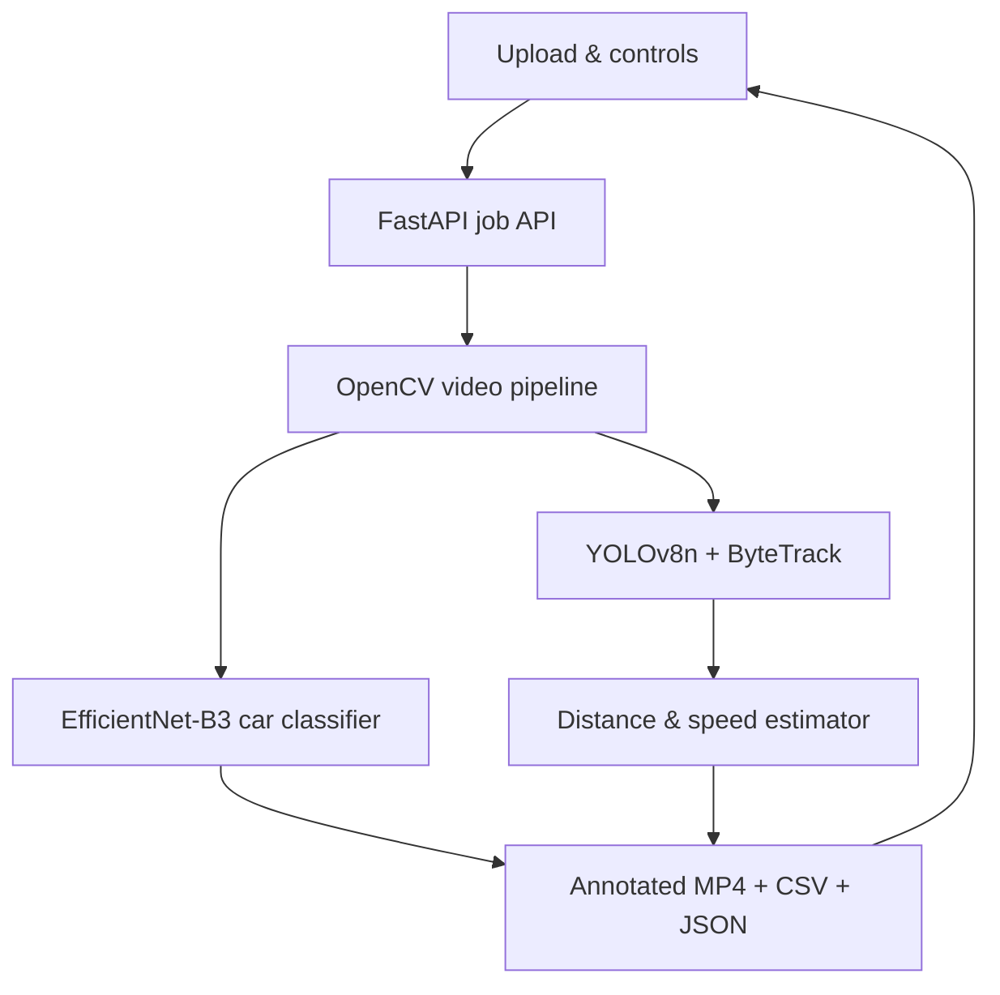

# TrafficVision AI

[](https://github.com/Arka0507/trafficvision-ai/actions)
[](https://colab.research.google.com/github/Arka0507/trafficvision-ai/blob/main/TrafficVision_AI_Colab.ipynb)
[](LICENSE)
[](https://python.org)

TrafficVision AI is an end-to-end video analytics application built with **YOLOv8n**, **ByteTrack**, **OpenCV**, **FastAPI**, and an optional **EfficientNet-B3 vehicle make/model classifier**. Upload a video in the browser and receive an annotated H.264 video plus track-level and frame-level reports.


## ⚡ 1-Click Cloud Run Directly From GitHub

Click the button below to run TrafficVision AI **live in your browser with Free NVIDIA GPU acceleration**:

[](https://colab.research.google.com/github/Arka0507/trafficvision-ai/blob/main/TrafficVision_AI_Colab.ipynb)

---

## 🚀 Run Locally in 1 Command (For Anyone)

Anyone can clone and run this repository in a single command:

### Windows:
```cmd
git clone https://github.com/Arka0507/trafficvision-ai.git && cd trafficvision-ai && .\setup_windows.bat && .\start_windows.bat
```

### Linux / macOS:
```bash
git clone https://github.com/Arka0507/trafficvision-ai.git && cd trafficvision-ai && chmod +x setup_unix.sh start_unix.sh && ./setup_unix.sh && ./start_unix.sh
```

### Docker (Zero Setup Required):
```bash
git clone https://github.com/Arka0507/trafficvision-ai.git && cd trafficvision-ai && docker compose up --build
```

## What the project does

- Detects all object categories supported by the selected YOLO weights (the default COCO model has 80 classes).
- Gives tracked objects stable ByteTrack IDs while they remain visible.
- Draws bounding boxes, class names, track IDs, trails, estimated distance, and estimated speed.
- Runs a second model on sufficiently large car crops to predict one of 196 Stanford Cars make/model/year classes.
- Aggregates multiple predictions per car and abstains as `Uncertain` when certainty or frame-to-frame agreement is insufficient.
- Accepts MP4, MOV, AVI, MKV, WebM, and M4V uploads up to 2 GB by default.
- Produces an annotated MP4, `tracks.csv`, optional `frame_detections.csv`, and `summary.json`.
- Provides a responsive, dependency-free web interface and asynchronous processing progress.

## Important accuracy boundary

This is a strong prototype, not a calibrated traffic-enforcement instrument.

1. **YOLO does not know every possible real-world object.** The default `yolov8n.pt` knows the 80 COCO categories. Train or supply custom YOLO weights to add domain-specific objects.
2. **A single RGB camera cannot provide exact metric distance by itself.** The default mode estimates range from field of view, bounding-box height, and a typical physical-height prior. Values marked with `~` are approximate.
3. **Uncalibrated speed is camera-relative and approximate.** For useful real-world speed, use a fixed camera and enter four measured image-to-ground point pairs in the Road-plane calibration control.
4. **Car-model recognition is closed-set.** EfficientNet-B3 predicts one of 196 Stanford Cars classes. Cars outside that dataset, small/occluded cars, and non-US traffic can be wrong even at high confidence. The application requires repeated agreement and can return `Uncertain`.

## Architecture



## Quick start on Windows / Antigravity

Requirements: Windows 10/11, Python 3.10–3.12, and FFmpeg recommended.

1. Open this folder in Antigravity.
2. Open its integrated terminal.
3. Run:

   ```bat
   .\setup_windows.bat
   ```

4. After setup finishes, run:

   ```bat
   .\start_windows.bat
   ```

5. Open [http://localhost:8000](http://localhost:8000). The start script normally opens it automatically.

The first analyzed video downloads `yolov8n.pt` (about 6 MB) and the fine-grained vehicle checkpoint (about 50 MB) into your normal model cache. Later runs reuse them.

See [ANTIGRAVITY_SETUP.md](ANTIGRAVITY_SETUP.md) for GPU setup, troubleshooting, and GitHub commands.

## macOS / Linux

```bash
chmod +x setup_unix.sh start_unix.sh
./setup_unix.sh
./start_unix.sh
```

Then open [http://localhost:8000](http://localhost:8000).

## Docker

```bash
docker compose up --build
```

The default Docker image uses CPU PyTorch. Open [http://localhost:8000](http://localhost:8000). Generated jobs and model downloads are kept in named volumes.

## Process a video without the UI

```bash
.venv/bin/python scripts/process_video.py /path/to/video.mp4 --output outputs/my-run
```

Windows:

```bat
.venv\Scripts\python scripts\process_video.py C:\path\to\video.mp4 --output outputs\my-run
```

Useful options:

```text
--confidence 0.30
--fov 70
--device 0          # first NVIDIA GPU
--no-car-model      # maximum detector speed
```

## Measurement model

Default monocular distance:

$$
f_{px}=\frac{W}{2\tan(\mathrm{FOV}/2)},\qquad
Z\approx\frac{H_{real}\,f_{px}}{h_{box}}
$$

The bottom-centre of each bounding box is converted to an approximate ground position. After at least 1.5 seconds of stable tracking, camera-relative speed is calculated over a temporal window and smoothed:

$$
v_{km/h}=\frac{\sqrt{(x_t-x_{t-\Delta})^2+(z_t-z_{t-\Delta})^2}}{\Delta t}\times3.6
$$

Road-plane mode instead applies a four-point perspective transform from image pixels to measured ground metres. See [docs/CALIBRATION.md](docs/CALIBRATION.md).

## API

When the server is running, interactive API documentation is available at [http://localhost:8000/docs](http://localhost:8000/docs).

| Method | Endpoint | Purpose |
| --- | --- | --- |
| `GET` | `/api/health` | Service status and capabilities |
| `POST` | `/api/jobs` | Upload a video and processing options |
| `GET` | `/api/jobs/{id}` | Poll progress and results |
| `POST` | `/api/jobs/{id}/cancel` | Safely request cancellation |
| `GET` | `/api/jobs/{id}/artifacts/{key}` | View/download video or reports |

## Main project structure

```text
backend/
  main.py                    FastAPI endpoints and static UI
  jobs.py                    background job manager
  processing/
    pipeline.py              YOLO/ByteTrack frame pipeline
    geometry.py              distance and speed estimation
    vehicle_classifier.py    196-class car make/model recognition
    drawing.py               overlays and trajectories
frontend/
  index.html                 upload and results workspace
  styles.css                 responsive visual system
  app.js                     uploads, progress polling, results
config/bytetrack_traffic.yaml
scripts/process_video.py
tests/
docs/
```

## Use custom YOLO classes

Set `detector_model` through the API or change its default in `backend/schemas.py` to a local `.pt` file trained for your object classes. Ultralytics model class names are read automatically. Keep custom weights outside Git or use Git LFS.

## Validation completed for this repository

- Python modules compile successfully.
- Ruff static checks pass.
- Seven automated API, geometry, homography/speed, and vehicle-classifier tests pass.
- JavaScript syntax check passes.
- The complete supplied 1920×1080, 2,802-frame traffic video completed detection, ByteTrack tracking, measurement overlay, car-classifier inference, H.264 conversion, and CSV/JSON export.
- The full run produced a 46.747-second H.264 output with all 2,802 frames, 239 unique tracks, and 48,789 frame-level detection rows.

See [VALIDATION_REPORT.md](VALIDATION_REPORT.md) for the exact configuration, media checks, class counts, and interpretation notes.

## Deployment

GitHub Pages cannot run this application because it requires Python, PyTorch, OpenCV, disk storage, and long-running video processing. Push the code to GitHub, then deploy the Docker image on a service that supports containers and sufficient CPU/GPU, memory, storage, and request size. See [docs/DEPLOYMENT.md](docs/DEPLOYMENT.md).

## Model and data licenses

- Application code: MIT (see `LICENSE`).
- YOLO/Ultralytics: review the current Ultralytics license for your intended use.
- Vehicle classifier: `twincar-group2/twincar-classifier` project code is MIT; its weights were trained on Stanford Cars and should be used in accordance with that dataset's terms.
